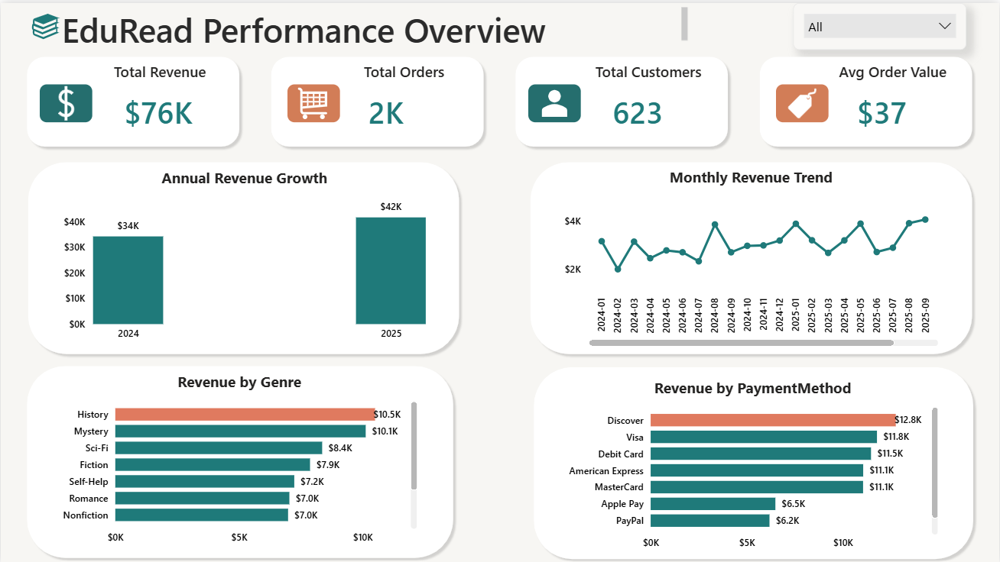

## EduRead Digital – Data Warehouse & Business Intelligence Project

An end-to-end data warehousing and analytics project for **EduRead Digital**, an online book retail platform. This project covers the full BI pipeline — from ETL development and dimensional modeling in SQL Server, through SSIS-based data loading, to executive-ready Power BI dashboards.

---

## Project Overview

| Detail | Description |
|---|---|
| **Business** | EduRead Digital |
| **Analysis Focus** | Sales trends, customer retention, content performance, and payment behavior |
| **Reporting Period** | 2024 – 2025 |
| **Source Database** | EdureadDB (OLTP) |
| **Target Database** | EduReadDataMart (Star Schema) |

---

## Repository Structure

```
EduReadDM-ETL/
│
├── SQL/
│   ├── Dimensions/
│   │   ├── DimBook.sql               # Book, genre, author, publisher extraction
│   │   ├── DimDate.sql               # Full date dimension (2015–2099)
│   │   ├── DimPaymentMethod.sql      # Payment method and type
│   │   └── DimStudent.sql            # Student profile with derived age
│   │
│   ├── Facts/
│   │   └── FactSales.sql             # Sales fact with measures and business keys
│   │
│   ├── Lookups/
│   │   ├── Lookup_Book_SK.sql        # Surrogate key lookup for DimBook
│   │   ├── Lookup_PaymentMethod_SK.sql  # Surrogate key lookup for DimPaymentMethod
│   │   └── Lookup_Student_SK.sql     # Surrogate key lookup for DimStudent
│   │
│   └── Validation/
│       └── Record_Count_by_Table.sql # Row count validation across all tables
│
├── ETL/                              # SSIS packages (.dtsx)
│
└── README.md
```

---

## Data Architecture

This project follows a **star schema** dimensional model built on SQL Server.

### Fact Table
**FactSales** — line-level sales transactions joining orders, book orders, and payments

| Column | Description |
|---|---|
| Order_BK, LineItem_BK, PaymentLine_BK | Degenerate keys |
| SalesDate | Date business key (YYYYMMDD) for DimDate lookup |
| Student_BK, Book_BK, Payment_BK | Business keys for SSIS surrogate key lookups |
| Quantity, UnitPrice, DiscountAmount | Line-level measures |
| SalesAmount | `(UnitPrice × Quantity) − DiscountAmount` |
| TaxAmount, NetSalesAmount | Tax and final net amount |
| PaymentAmount | Payment line amount |

### Dimension Tables

| Table | Key Fields | Notes |
|---|---|---|
| **DimBook** | BookTitle, Genre, Category, Author, Publisher | Uses `ROW_NUMBER()` to resolve multi-author books to primary author |
| **DimDate** | Full calendar attributes | Covers 2015–2099; includes holidays, seasons, weekday flags |
| **DimStudent** | Name, Age, Gender, City, State | Age derived dynamically from DateOfBirth |
| **DimPaymentMethod** | PaymentMethodName, PaymentType | Card vs. digital wallet classification |

---

## ETL Pipeline

Built using **SQL Server Integration Services (SSIS)**. Each SSIS package:
1. Extracts data from `EdureadDB` (OLTP) using the SQL scripts above
2. Performs surrogate key lookups against `EduReadDataMart` dimension tables
3. Loads transformed data into the target data mart
4. Validates row counts using `Record_Count_by_Table.sql`

### Surrogate Key Lookups
SSIS lookup components resolve business keys to surrogate keys before loading `FactSales`:
- `Lookup_Book_SK.sql` → maps `Book_BK` to `Book_SK`
- `Lookup_Student_SK.sql` → maps `Student_BK` to `Student_SK`
- `Lookup_PaymentMethod_SK.sql` → maps `Payment_BK` to `Payment_SK`

---

## Key Findings

Analysis conducted using SQL and Python against `EduReadDataMart`.

**Revenue & Growth**
- Total revenue grew from **$34,273 in 2024** to **$41,704 in 2025** — a $7,400+ year-over-year increase
- Average order value held steady at ~$37, meaning growth came from higher order volume, not price changes

**Customer Retention**
- Repeat customers make up the majority of the customer base and generate the large share of total revenue
- One-time buyers represent a meaningful conversion opportunity

**Content Performance**
- Top genres: **History, Mystery, and Sci-Fi**
- Top authors: Isabella Garcia, Noah Garcia, and Benjamin Garcia
- Kids content was the lowest-performing genre

**Payment Behavior**
- Card-based payments (Discover, Visa, MasterCard, Debit) dominate transaction volume
- Digital wallets (Apple Pay, PayPal, Google Pay) represent a smaller but growing share

---

## Power BI Dashboard
[](<iframe title="EduRead PowerBI Dashboard" width="600" height="373.5" src="https://app.powerbi.com/view?r=eyJrIjoiZmM3M2NiMjctNzE2OC00Y2Y2LThjOGUtYTc3NmY3MjQzZDU3IiwidCI6IjZmM2M3MDM3LTg1YzItNDBlNi05ZGVjLTE4YjAyZDI4OTI4OCIsImMiOjZ9" frameborder="0" allowFullScreen="true"></iframe>)
## Power BI Dashboard
[](https://app.powerbi.com/view?r=eyJrIjoiZmM3M2NiMjctNzE2OC00Y2Y2LThjOGUtYTc3NmY3MjQzZDU3IiwidCI6IjZmM2M3MDM3LTg1YzItNDBlNi05ZGVjLTE4YjAyZDI4OTI4OCIsImMiOjZ9)

An interactive Power BI dashboard visualizes:
- Year-over-year revenue and order trends
- Customer segmentation (repeat vs. one-time buyers)
- Genre and author-level sales performance
- Monthly demand patterns
- Payment method distribution

---

## Tools & Technologies

| Layer | Tool |
|---|---|
| Source Database | SQL Server (EdureadDB) |
| Data Mart | SQL Server (EduReadDataMart) |
| ETL | SSIS (SQL Server Integration Services) |
| Data Modeling | Star Schema / Dimensional Modeling |
| Scripting | SQL, Python |
| Visualization | Power BI |

---

## Author

**Ketty Odero**  
MS Business Analytics — University of Denver, Daniels College of Business  
[LinkedIn](https://www.linkedin.com/in/kettyaldy/) | [GitHub](https://github.com/Ketty-Odero)